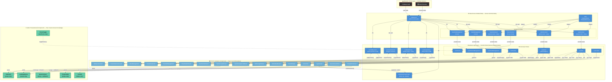

```mermaid
graph TD

    %% ============================================================
    %% STYLE DEFINITIONS
    %% ============================================================
    classDef backend fill:#2d2d2d,stroke:#ff6b6b,color:#ffffff,stroke-width:2px,font-weight:bold
    classDef serverLogic fill:#4a90d9,stroke:#2c5f99,color:#ffffff,stroke-width:2px
    classDef smart fill:#6baed6,stroke:#2171b5,color:#ffffff,stroke-width:2px
    classDef pureUI fill:#66cdaa,stroke:#2e8b57,color:#1a1a1a,stroke-width:2px,font-weight:bold
    classDef util fill:#c9a0dc,stroke:#8b5eb5,color:#1a1a1a,stroke-width:2px

    %% ============================================================
    %% LAYER 1: BACKEND / CLOUD LAYER
    %% ============================================================
    subgraph BACKEND["☁️ Backend / Cloud Layer — Firebase Services"]
        direction LR
        FA["🔐 Firebase Auth"]
        FS["🗄️ Cloud Firestore"]
    end

    %% ============================================================
    %% LAYER 2: DATA ACCESS & GLOBAL STATE (Server-Communicating)
    %% ============================================================
    subgraph DATA_ACCESS["⚙️ Data Access & Global State — Server-Communicating"]
        direction LR
        FB["firebase.jsx\n(SDK Init: db, auth)"]
        UTILS["utils/\nfirebaseUtils.js\nfirebaseErrors.jsx"]

        subgraph CONTEXTS["Context Providers"]
            direction LR
            AUTH_CTX["AuthContext\n(Student Auth + Data)"]
            ADMIN_CTX["AdminContext\n(Admin Auth + Data)"]
            TEACHER_CTX["TeacherContext\n(Teacher Auth + Data)"]
            THEME_CTX["ThemeContext\n(Theme State)"]
            TM_CTX["TeacherManagement\nContext"]
            CM_CTX["ClassManagement\nContext"]
        end
    end

    %% ============================================================
    %% LAYER 3: BUSINESS LOGIC LAYER (Server-Communicating Hooks)
    %% ============================================================
    subgraph HOOKS["🔗 Business Logic Layer — Custom Hooks (Server-Communicating)"]
        direction LR
        H_QUEST["useQuestionnaireLogic\n(Fetch Q's, Submit)"]
        H_CREATE_CLS["useCreateClass\n(Write Class to DB)"]
        H_DELETE_CLS["useDeleteClass\n(Delete Class + Subs)"]
        H_CREATE_TCH["useCreateTeacher\n(Register Teacher)"]
        H_ADD_Q["useAddQuestion\n(Write Question to DB)"]

        subgraph HOOKS_THIN["Thin Accessor Hooks"]
            direction LR
            H_AUTH["useAuth"]
            H_TEACHER["useTeacher"]
            H_ADMIN["useAdmin\n(adminHelpers)"]
            H_CLS_MGMT["useClassManagement"]
            H_TCH_MGMT["useTeacherManagement"]
            H_THEME["useTheme"]
            H_CONFETTI["useConfetti"]
        end
    end

    %% ============================================================
    %% LAYER 4: SMART / CONTAINER COMPONENTS (Page-Level)
    %% ============================================================
    subgraph SMART["📦 Smart / Container Components — Page-Level Orchestrators"]
        direction LR
        LOGIN["LoginScreen"]
        Q_FLOW["QuestionnaireFlow"]
        COMPLETE["CompletionScreen"]
        GAME["GameView"]
        STREAK["StreakDisplay"]
        ADMIN_LOGIN["AdminLoginScreen"]
        ADMIN_DASH["AdminDashboard"]
        ADD_Q_FORM["AddQuestionForm"]
        Q_APPROVAL["QuestionsApprovalModal"]
        TCH_LOGIN["TeacherLoginScreen"]
        TCH_DASH["TeacherDashboard"]
        CREATE_CLS["CreateClassForm"]
        CLS_MGMT["ClassManagement"]
        CLS_CODES["ClassStudentCodes"]
        CREATE_TCH["CreateTeacherAccount"]
        TCH_MGMT["TeacherManagement"]
    end

    %% ============================================================
    %% LAYER 5: DUMB / PRESENTATIONAL COMPONENTS (Pure UI)
    %% ============================================================
    subgraph PURE_UI["🎨 Dumb / Presentational Components — Pure UI (Zero Server Knowledge)"]
        direction LR
        UI_SPINNER["LoadingSpinner\n(props only)"]
        UI_PROGRESS["ProgressBar\n(props only)"]
        UI_Q_INPUT["QuestionInput\n(props + callbacks)"]
        UI_CONFETTI["Confetti\n(props only)"]
        UI_STATS["StatsCard\n(props only)"]
        UI_THEME_TOG["ThemeToggle\n(useTheme only)"]
    end

    %% ============================================================
    %% EDGES: FIREBASE → SDK CONFIG
    %% ============================================================
    FA -->|"Auth SDK"| FB
    FS -->|"Firestore SDK"| FB

    %% ============================================================
    %% EDGES: firebase.jsx → Contexts & Utils
    %% ============================================================
    FB -->|"db, auth"| AUTH_CTX
    FB -->|"db, auth"| ADMIN_CTX
    FB -->|"db, auth"| TEACHER_CTX
    FB -->|"db"| CM_CTX
    FB -->|"db"| TM_CTX
    UTILS -->|"helpers"| AUTH_CTX
    UTILS -->|"helpers"| ADMIN_CTX
    UTILS -->|"helpers"| TEACHER_CTX
    UTILS -->|"helpers"| CM_CTX
    UTILS -->|"helpers"| TM_CTX

    %% ============================================================
    %% EDGES: firebase.jsx → Hooks (Direct DB Access)
    %% ============================================================
    FB -->|"db"| H_QUEST
    FB -->|"db"| H_CREATE_CLS
    FB -->|"db"| H_DELETE_CLS
    FB -->|"db, auth"| H_CREATE_TCH
    FB -->|"db"| H_ADD_Q

    %% ============================================================
    %% EDGES: Contexts → Thin Accessor Hooks
    %% ============================================================
    AUTH_CTX -->|"provides state"| H_AUTH
    ADMIN_CTX -->|"provides state"| H_ADMIN
    TEACHER_CTX -->|"provides state"| H_TEACHER
    THEME_CTX -->|"provides state"| H_THEME
    CM_CTX -->|"provides state"| H_CLS_MGMT
    TM_CTX -->|"provides state"| H_TCH_MGMT

    %% ============================================================
    %% EDGES: Hooks → Smart Components (Data Down)
    %% ============================================================
    H_AUTH -->|"user, login"| LOGIN
    H_AUTH -->|"user"| Q_FLOW
    H_QUEST -->|"questions, submit"| Q_FLOW
    H_AUTH -->|"user, streak"| COMPLETE
    H_CONFETTI -->|"confetti state"| COMPLETE
    H_AUTH -->|"user, coins"| GAME
    H_AUTH -->|"user, streak"| STREAK
    H_ADMIN -->|"admin state"| ADMIN_LOGIN
    H_ADMIN -->|"admin, data"| ADMIN_DASH
    H_ADD_Q -->|"addQuestion"| ADD_Q_FORM
    H_ADMIN -->|"admin"| Q_APPROVAL
    H_TEACHER -->|"teacher state"| TCH_LOGIN
    H_TEACHER -->|"teacher, data"| TCH_DASH
    H_CREATE_CLS -->|"createClass"| CREATE_CLS
    H_DELETE_CLS -->|"deleteClass"| CLS_MGMT
    H_CLS_MGMT -->|"classes"| CLS_CODES
    H_CREATE_TCH -->|"createTeacher"| CREATE_TCH
    H_TCH_MGMT -->|"teachers"| TCH_MGMT

    %% ============================================================
    %% EDGES: Smart Components → Pure UI (Props Down)
    %% ============================================================
    Q_FLOW -->|"props"| UI_PROGRESS
    Q_FLOW -->|"props + callbacks"| UI_Q_INPUT
    Q_FLOW -->|"props"| UI_SPINNER
    COMPLETE -->|"props"| UI_CONFETTI
    ADMIN_DASH -->|"props"| UI_STATS
    ADMIN_DASH -->|"props"| UI_SPINNER
    TCH_DASH -->|"props"| UI_STATS
    TCH_DASH -->|"props"| UI_SPINNER

    %% ============================================================
    %% EDGES: Callbacks / Events (Dotted — Going Back Up)
    %% ============================================================
    UI_Q_INPUT -.->|"onChange / onSubmit"| Q_FLOW
    UI_THEME_TOG -.->|"toggleTheme()"| H_THEME
    LOGIN -.->|"login(token)"| H_AUTH
    Q_FLOW -.->|"submitAnswers()"| H_QUEST
    ADMIN_LOGIN -.->|"adminLogin()"| H_ADMIN
    TCH_LOGIN -.->|"teacherLogin()"| H_TEACHER
    CREATE_CLS -.->|"createClass()"| H_CREATE_CLS
    CLS_MGMT -.->|"deleteClass()"| H_DELETE_CLS
    CREATE_TCH -.->|"createTeacher()"| H_CREATE_TCH
    ADD_Q_FORM -.->|"addQuestion()"| H_ADD_Q

    %% ============================================================
    %% APPLY STYLES
    %% ============================================================
    class FA,FS backend
    class FB,UTILS,AUTH_CTX,ADMIN_CTX,TEACHER_CTX,THEME_CTX,TM_CTX,CM_CTX serverLogic
    class H_QUEST,H_CREATE_CLS,H_DELETE_CLS,H_CREATE_TCH,H_ADD_Q,H_AUTH,H_TEACHER,H_ADMIN,H_CLS_MGMT,H_TCH_MGMT,H_THEME,H_CONFETTI serverLogic
    class LOGIN,Q_FLOW,COMPLETE,GAME,STREAK,ADMIN_LOGIN,ADMIN_DASH,ADD_Q_FORM,Q_APPROVAL,TCH_LOGIN,TCH_DASH,CREATE_CLS,CLS_MGMT,CLS_CODES,CREATE_TCH,TCH_MGMT smart
    class UI_SPINNER,UI_PROGRESS,UI_Q_INPUT,UI_CONFETTI,UI_STATS,UI_THEME_TOG pureUI
```
