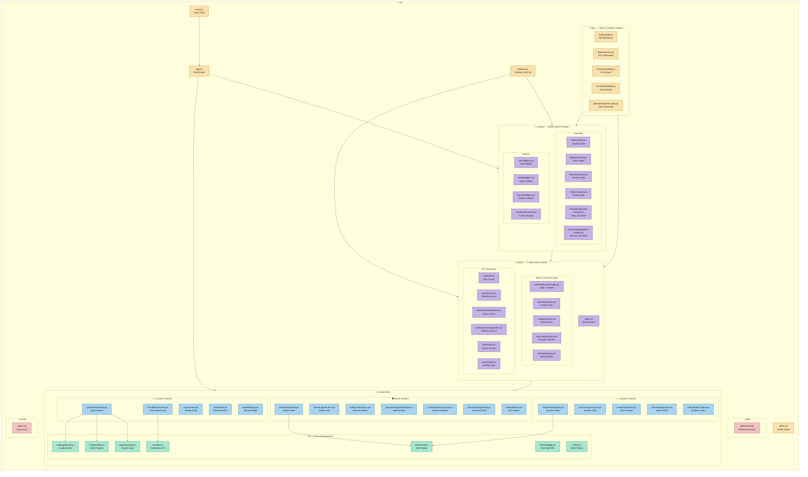

```mermaid
graph TD

    %% ============================================================
    %% STYLE DEFINITIONS
    %% ============================================================
    classDef smartComp fill:#a8d4f0,stroke:#5a9ec9,color:#1a1a1a,stroke-width:2px
    classDef pureUI fill:#a8e6cf,stroke:#56b88a,color:#1a1a1a,stroke-width:2px
    classDef logic fill:#c5b3e6,stroke:#8a6dbf,color:#1a1a1a,stroke-width:2px
    classDef config fill:#f9e2ae,stroke:#d4a843,color:#1a1a1a,stroke-width:2px
    classDef dataFile fill:#f0c4c4,stroke:#c97070,color:#1a1a1a,stroke-width:2px

    %% ============================================================
    %% ROOT: src/
    %% ============================================================
    subgraph SRC["📁 src/"]
        direction TB

        APP["App.jsx<br/><i>Root Router</i>"]
        MAIN["main.jsx<br/><i>Entry Point</i>"]
        INDEX_CSS["index.css<br/><i>Global Styles</i>"]
        FIREBASE["firebase.jsx<br/><i>Firebase SDK Init</i>"]

        MAIN --> APP

        %% ========================================================
        %% COMPONENTS
        %% ========================================================
        subgraph COMP["📁 components/"]
            direction TB

            %% ---- Student Screens ----
            subgraph COMP_STUDENT["👨‍🎓 Student Screens"]
                direction LR
                C_LOGIN["LoginScreen.jsx<br/><i>Student Auth</i>"]
                C_QUEST["QuestionnaireFlow.jsx<br/><i>Diary Wizard</i>"]
                C_COMPLETE["CompletionScreen.jsx<br/><i>Post-Submit View</i>"]
                C_GAME["GameView.jsx<br/><i>Rewards Store</i>"]
                C_STREAK["StreakDisplay.jsx<br/><i>Streak Widget</i>"]
            end

            %% ---- Admin Screens ----
            subgraph COMP_ADMIN["🛡️ Admin Screens"]
                direction LR
                C_ADMIN_LOGIN["AdminLoginScreen.jsx<br/><i>Admin Auth</i>"]
                C_ADMIN_DASH["AdminDashboard.jsx<br/><i>Admin Panel</i>"]
                C_ADD_Q["AddQuestionForm.jsx<br/><i>Question Editor</i>"]
                C_Q_APPROVE["QuestionsApprovalModal.jsx<br/><i>Q&A Review</i>"]
                C_CREATE_TCH["CreateTeacherAccount.jsx<br/><i>Teacher Register</i>"]
                C_TCH_MGMT["TeacherManagement.jsx<br/><i>Teacher CRUD</i>"]
                C_DEBUG["DebugSeeder.jsx<br/><i>Dev Seeder</i>"]
            end

            %% ---- Teacher Screens ----
            subgraph COMP_TEACHER["👩‍🏫 Teacher Screens"]
                direction LR
                C_TCH_LOGIN["TeacherLoginScreen.jsx<br/><i>Teacher Auth</i>"]
                C_TCH_DASH["TeacherDashboard.jsx<br/><i>Teacher Panel</i>"]
                C_CREATE_CLS["CreateClassForm.jsx<br/><i>Class Creator</i>"]
                C_CLS_MGMT["ClassManagement.jsx<br/><i>Class CRUD</i>"]
                C_CLS_CODES["ClassStudentCodes.jsx<br/><i>Student Codes</i>"]
            end

            %% ---- Pure UI ----
            subgraph COMP_UI["📁 ui/ — Pure Presentational"]
                direction LR
                UI_SPINNER["LoadingSpinner.jsx<br/><i>Loading Anim</i>"]
                UI_PROGRESS["ProgressBar.jsx<br/><i>Step Progress</i>"]
                UI_Q_INPUT["QuestionInput.jsx<br/><i>Answer Input</i>"]
                UI_CONFETTI["Confetti.jsx<br/><i>Celebration FX</i>"]
                UI_STATS["StatsCard.jsx<br/><i>Stat Display</i>"]
                UI_THEME["ThemeToggle.jsx<br/><i>Dark/Light Btn</i>"]
                UI_INDEX["index.jsx<br/><i>Barrel Export</i>"]
            end
        end

        %% ========================================================
        %% CONTEXT
        %% ========================================================
        subgraph CTX["📁 context/ — Global State Providers"]
            direction TB
            subgraph CTX_PROVIDERS["Providers"]
                direction LR
                CTX_AUTH["AuthContext.jsx<br/><i>Student State</i>"]
                CTX_ADMIN["AdminContext.jsx<br/><i>Admin State</i>"]
                CTX_TEACHER["TeacherContext.jsx<br/><i>Teacher State</i>"]
                CTX_THEME["ThemeContext.jsx<br/><i>Theme State</i>"]
                CTX_CLS_MGMT["ClassManagement<br/>Context.jsx<br/><i>Class List State</i>"]
                CTX_TCH_MGMT["TeacherManagement<br/>Context.jsx<br/><i>Teacher List State</i>"]
            end
            subgraph CTX_HELPERS["Helpers"]
                direction LR
                CTX_AUTH_H["authHelpers.jsx<br/><i>Auth Utilities</i>"]
                CTX_ADMIN_H["adminHelpers.jsx<br/><i>Admin Utilities</i>"]
                CTX_TCH_H["teacherHelpers.jsx<br/><i>Teacher Utilities</i>"]
                CTX_CREATE["createAuthContext.jsx<br/><i>Context Factory</i>"]
            end
        end

        %% ========================================================
        %% HOOKS
        %% ========================================================
        subgraph HOOKS["📁 hooks/ — Custom React Hooks"]
            direction TB
            subgraph HOOKS_SERVER["Server-Communicating"]
                direction LR
                H_QUEST["useQuestionnaireLogic.jsx<br/><i>Q&A + Submit</i>"]
                H_CREATE_CLS["useCreateClass.jsx<br/><i>Create Class</i>"]
                H_DELETE_CLS["useDeleteClass.jsx<br/><i>Delete Class</i>"]
                H_CREATE_TCH["useCreateTeacher.jsx<br/><i>Register Teacher</i>"]
                H_ADD_Q["useAddQuestion.jsx<br/><i>Add Question</i>"]
            end
            subgraph HOOKS_ACCESS["Thin Accessors"]
                direction LR
                H_AUTH["useAuth.jsx<br/><i>Auth Access</i>"]
                H_TEACHER["useTeacher.jsx<br/><i>Teacher Access</i>"]
                H_CLS["useClassManagement.jsx<br/><i>Class Access</i>"]
                H_TCH_M["useTeacherManagement.jsx<br/><i>Teacher Access</i>"]
                H_THEME["useTheme.jsx<br/><i>Theme Access</i>"]
                H_CONFETTI["useConfetti.jsx<br/><i>Confetti Logic</i>"]
            end
            H_INDEX["index.jsx<br/><i>Barrel Export</i>"]
        end

        %% ========================================================
        %% UTILS
        %% ========================================================
        subgraph UTILS["📁 utils/ — Utility & Firebase Helpers"]
            direction LR
            U_FB_UTILS["firebaseUtils.js<br/><i>DB Operations</i>"]
            U_FB_ERR["firebaseErrors.jsx<br/><i>Error Messages</i>"]
            U_CSV["CSVExportUtility.jsx<br/><i>CSV Export</i>"]
            U_EXCEL["ExcelExportUtility.jsx<br/><i>Excel Export</i>"]
            U_CODES["generateStudentCodes.jsx<br/><i>Code Generator</i>"]
        end

        %% ========================================================
        %% DATA & ASSETS
        %% ========================================================
        subgraph DATA["📁 data/"]
            direction LR
            D_QUESTIONS["questions.json<br/><i>Default Questions</i>"]
        end

        subgraph ASSETS["📁 assets/"]
            direction LR
            A_REACT["react.svg<br/><i>Logo Asset</i>"]
        end

    end

    %% ============================================================
    %% HIERARCHY CONNECTIONS
    %% ============================================================
    APP --> COMP
    APP --> CTX
    FIREBASE --> CTX
    FIREBASE --> HOOKS
    CTX --> HOOKS
    HOOKS --> COMP
    UTILS --> CTX
    UTILS --> HOOKS

    %% Smart Components → Pure UI
    C_QUEST --> UI_PROGRESS
    C_QUEST --> UI_Q_INPUT
    C_QUEST --> UI_SPINNER
    C_COMPLETE --> UI_CONFETTI
    C_ADMIN_DASH --> UI_STATS
    C_TCH_DASH --> UI_STATS

    %% ============================================================
    %% APPLY STYLES
    %% ============================================================
    class C_LOGIN,C_QUEST,C_COMPLETE,C_GAME,C_STREAK smartComp
    class C_ADMIN_LOGIN,C_ADMIN_DASH,C_ADD_Q,C_Q_APPROVE,C_CREATE_TCH,C_TCH_MGMT,C_DEBUG smartComp
    class C_TCH_LOGIN,C_TCH_DASH,C_CREATE_CLS,C_CLS_MGMT,C_CLS_CODES smartComp

    class UI_SPINNER,UI_PROGRESS,UI_Q_INPUT,UI_CONFETTI,UI_STATS,UI_THEME,UI_INDEX pureUI

    class CTX_AUTH,CTX_ADMIN,CTX_TEACHER,CTX_THEME,CTX_CLS_MGMT,CTX_TCH_MGMT logic
    class CTX_AUTH_H,CTX_ADMIN_H,CTX_TCH_H,CTX_CREATE logic
    class H_QUEST,H_CREATE_CLS,H_DELETE_CLS,H_CREATE_TCH,H_ADD_Q logic
    class H_AUTH,H_TEACHER,H_CLS,H_TCH_M,H_THEME,H_CONFETTI,H_INDEX logic

    class FIREBASE,APP,MAIN,INDEX_CSS config
    class U_FB_UTILS,U_FB_ERR,U_CSV,U_EXCEL,U_CODES config

    class D_QUESTIONS,A_REACT dataFile
```
